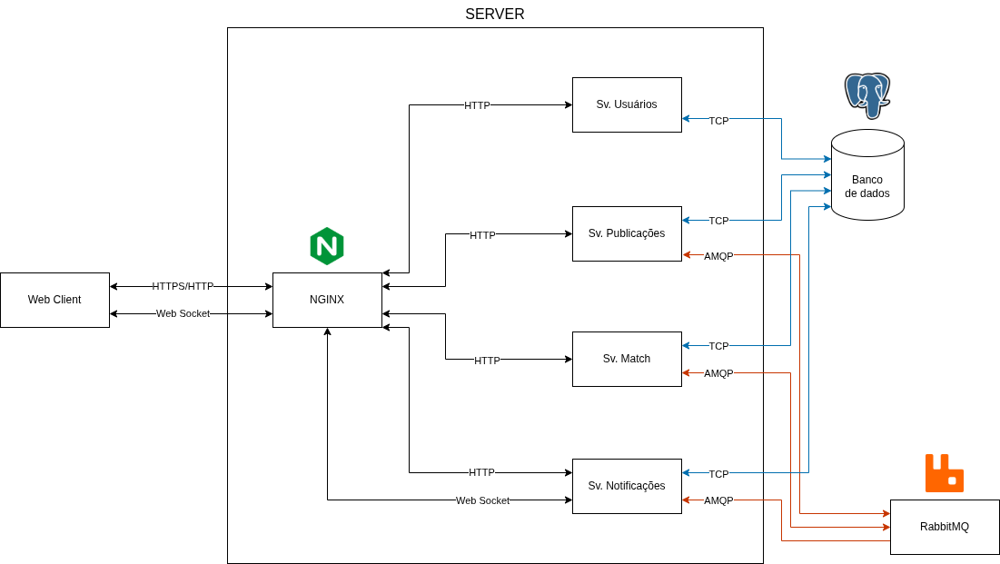

# Marketplace de Trocas — Sistema Distribuído

Aplicação distribuída de marketplace para troca de itens, desenvolvida com microsserviços em NestJS, RabbitMQ, PostgreSQL e WebSocket.

## Arquitetura



A documentação da arquitetura do sistema, fluxos e as interfaces estão aqui: [Descrição arquitetura.pdf](./Descrição%20arquitetura.pdf).

## Tecnologias utilizadas

- **NestJS** — _framework_ dos microsserviços de backend.
- **RabbitMQ** — _message broker_ para comunicação assíncrona entre serviços.
- **ReactJS** — biblioteca de UI do frontend.
- **PostgreSQL** — banco de dados.
- **Docker** e **Docker Compose** — _containers_ e orquestração.

## Bibliotecas usadas

**Backend (NestJS 11):**

- `@nestjs/*` (core, common, config, jwt, passport, microservices, websockets, swagger, typeorm) — framework e integrações.
- `typeorm` + `pg` — ORM e driver PostgreSQL.
- `amqplib` / `amqp-connection-manager` — cliente RabbitMQ (AMQP).
- `passport` + `passport-jwt` — autenticação JWT.
- `bcrypt` — hash de senhas (sv-usuarios).
- `class-validator` / `class-transformer` — validação de DTOs.
- `socket.io` / `@nestjs/platform-socket.io` — WebSocket (sv-notificacao).

**Frontend:**

- `react` / `react-dom` — biblioteca de UI.
- `react-router-dom` — roteamento.
- `socket.io-client` — cliente WebSocket de notificações.
- `vite` — build/dev server; `tailwindcss` — estilos.

## Como compilar

Requisitos: **Docker** + **Docker Compose** (recomendado); ou, para dev local, **Node.js 22+** e **Yarn**.

Backend — todos os serviços via Docker:

```bash
cd server
docker compose -f docker-compose.yaml build
```

Backend — um serviço isolado (ex.: sv-usuarios):

```bash
cd server/sv-usuarios && yarn install && yarn build
```

Frontend:

```bash
cd client && yarn install && yarn build
```

## Como executar

### Sistema completo

```bash
cd server
./run.sh
```

Ou diretamente:

```bash
docker compose -f server/docker-compose.yaml up --build
```

### Apenas o banco de dados (para desenvolvimento local)

```bash
cd server
./run-database.sh
./run-rabbitmq.sh
```

Em seguida, inicie cada serviço individualmente:

```bash
cd server/sv-usuarios && yarn install && yarn start:dev
cd server/sv-publicacoes && yarn install && yarn start:dev
cd server/sv-match && yarn install && yarn start:dev
cd server/sv-notificacao && yarn install && yarn start:dev
```

### Frontend (desenvolvimento)

```bash
cd client && yarn install && yarn dev
```

Portas: usuários **3001**, publicações **3002**, match **3003**, notificação **3004**, PostgreSQL **5433**, RabbitMQ **5672** (admin **15672**), NGINX **80**. Swagger de cada serviço em `/docs` (ex.: `http://localhost:3002/docs`).

## Alunos

- Alexandre Borges Baccarini Junior — 2515520
- Leonardo Naime Lima — 2515660
